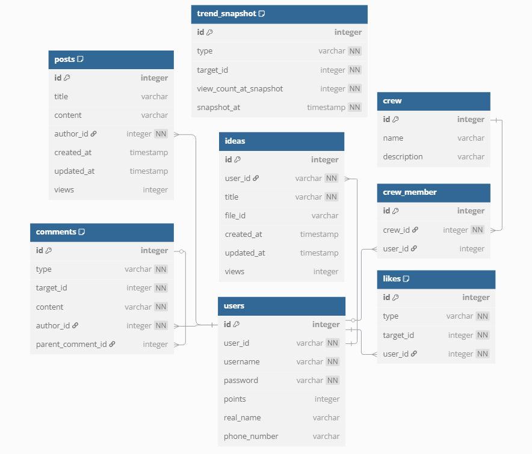

# 기술 스택

### 🧱 Backend

- **Language**: Java 17
- **Framework**: Spring Boot 3.4.2
- **Build Tool**: Gradle
- **Database**: PostgreSQL
- **ORM**: Spring Data JPA
- **Security**: Spring Security + JWT

### 🧪 Test

- **In-memory DB**: H2
- **Test Frameworks**: JUnit 5, Spring Security Test

### 🔧 기타

- **Lombok**: 반복 코드 제거

# ERD 다이어그램

# API 문서

## 📝 Post 관련 (post-controller)

| Method | Endpoint                          | 설명              | 요청 파라미터                        | Body           |
|--------|-----------------------------------|-------------------|--------------------------------------|----------------|
| GET    | `/posts`                          | 게시글 전체 조회   | 없음                                 | ❌              |
| POST   | `/posts`                          | 게시글 생성        | 없음                                 | ✅ PostRequest  |
| PUT    | `/posts/{id}`                     | 게시글 수정        | `id` (path)                          | ✅ PostRequest  |
| DELETE | `/posts/{id}`                     | 게시글 삭제        | `id` (path), `authorId` (query)      | ❌              |
| GET    | `/posts/user/{userId}`            | 특정 유저의 게시글 | `userId` (path)                      | ❌              |
| GET    | `/posts/search`                   | 게시글 검색        | `keyword` (query)                    | ❌              |

## 💬 Comment 관련 (comment-controller)

| Method | Endpoint                              | 설명            | 요청 파라미터                                 | Body             |
|--------|---------------------------------------|------------------|-----------------------------------------------|------------------|
| POST   | `/comments`                           | 댓글 생성         | 없음                                          | ✅ CommentRequest |
| PUT    | `/comments/{commentId}`               | 댓글 수정         | `commentId` (path)                            | ✅ CommentRequest |
| DELETE | `/comments/{commentId}`               | 댓글 삭제         | `commentId` (path)                            | ❌                |
| GET    | `/comments/{type}/{targetId}`         | 댓글 조회         | `type`, `targetId` (path)                     | ❌                |

## ❤️ Like 관련 (like-controller)

| Method | Endpoint                                 | 설명              | 요청 파라미터                                      | Body   |
|--------|------------------------------------------|-------------------|----------------------------------------------------|--------|
| POST   | `/likes/{type}/{targetId}`               | 좋아요 등록        | `type`, `targetId` (path)                          | ✅ User |
| DELETE | `/likes/{type}/{targetId}`               | 좋아요 취소        | `type`, `targetId` (path)                          | ✅ User |
| GET    | `/likes/{type}/{targetId}/liked`         | 좋아요 여부 확인    | `type`, `targetId` (path), `user` (query)          | ❌      |
| GET    | `/likes/{type}/{targetId}/count`         | 좋아요 수 조회      | `type`, `targetId` (path)                          | ❌      |

## 👥 Crew 관련 (crew-controller)

| Method | Endpoint                                 | 설명               | 요청 파라미터                               | Body            |
|--------|------------------------------------------|--------------------|---------------------------------------------|-----------------|
| POST   | `/crews`                                 | 크루 생성           | 없음                                        | ✅ CrewRequest   |
| PUT    | `/crews/{crewId}`                        | 크루 정보 수정       | `crewId` (path)                             | ✅ CrewRequest   |
| POST   | `/crews/{crewId}/join/{userId}`          | 크루 가입            | `crewId`, `userId` (path)                   | ❌               |
| POST   | `/crews/{crewId}/leave/{userId}`         | 크루 탈퇴            | `crewId`, `userId` (path)                   | ❌               |

## 💡 Idea 관련 (idea-controller)

| Method | Endpoint                          | 설명                   | 요청 파라미터              | Body               |
|--------|-----------------------------------|------------------------|-----------------------------|--------------------|
| POST   | `/ideas/generate`                 | 아이디어 영상 생성      | 없음                        | ✅ IdeaRequest      |
| POST   | `/ideas/update-file-id`           | 아이디어 파일 ID 수정   | 없음                        | ✅ FileUpdateRequest|
| GET    | `/ideas/list/{userId}`            | 사용자 아이디어 조회    | `userId` (path)             | ❌                  |
| DELETE | `/ideas/{ideaId}`                 | 아이디어 삭제           | `ideaId` (path)             | ❌                  |

## 👤 User 관련 (user-controller)

| Method | Endpoint                              | 설명               | 요청 파라미터                           | Body  |
|--------|---------------------------------------|--------------------|-----------------------------------------|--------|
| GET    | `/users/{userId}/points`              | 포인트 조회         | `userId` (path)                         | ❌      |
| POST   | `/users/{userId}/points/add`          | 포인트 추가         | `userId` (path), `amount` (query)       | ❌      |
| POST   | `/users/{userId}/points/deduct`       | 포인트 차감         | `userId` (path), `amount` (query)       | ❌      |
| DELETE | `/users/{userId}`                     | 사용자 삭제         | `userId` (path)                         | ❌      |

## 🔐 Auth 관련 (auth-controller)

| Method | Endpoint           | 설명       | 요청 파라미터 | Body             |
|--------|--------------------|------------|----------------|------------------|
| POST   | `/auth/register`   | 회원가입    | 없음           | ✅ RegisterRequest|
| POST   | `/auth/login`      | 로그인      | 없음           | ✅ LoginRequest   |

## 📊 Trend 관련 (trend-controller)

| Method | Endpoint       | 설명           | 요청 파라미터 | Body |
|--------|----------------|----------------|----------------|------|
| GET    | `/trend`       | 트렌드 조회     | 없음           | ❌    |

