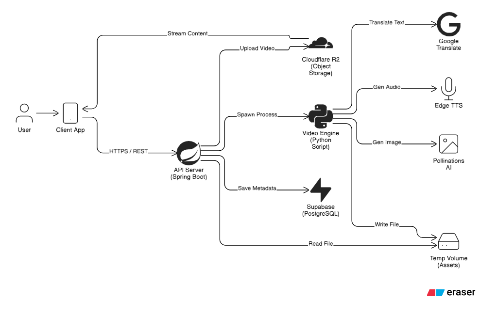
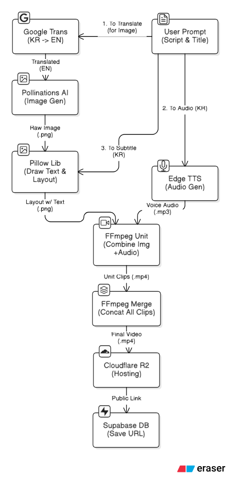

# 🎬 발명아이디어 플랫폼 (IAKKA)

AI 기반 비디오 생성 기능을 통합한 Spring Boot 백엔드 플랫폼입니다.

[](https://www.oracle.com/java/)
[](https://spring.io/projects/spring-boot)
[](https://www.python.org/)

---

## 📋 목차

- [주요 기능](#-주요-기능)
- [기술 스택](#-기술-스택)
- [빠른 시작](#-빠른-시작)
- [프로젝트 구조](#-프로젝트-구조)
- [API 문서](#-api-문서)
- [비디오 생성 프로세스](#-비디오-생성-프로세스)
- [배포](#-배포)
- [개발 가이드](#-개발-가이드)

---

## 🏗️ 인프라 아키텍처



### 주요 컴포넌트

- **Client Layer**: 웹/모바일 클라이언트
- **Application Layer**: Spring Boot + Python 비디오 생성 파이프라인
- **Data Layer**: Supabase PostgreSQL 데이터베이스
- **Storage Layer**: Cloudflare R2 오브젝트 스토리지
- **External Services**: AI 이미지 생성 및 TTS API

---

## ✨ 주요 기능

- **AI 비디오 생성**: 텍스트 스크립트를 입력하면 자동으로 TTS, 이미지, BGM이 결합된 영상 생성
- **커뮤니티 플랫폼**: 게시글, 댓글, 좋아요, 크루 시스템
- **JWT 인증**: 안전한 사용자 인증 및 권한 관리
- **클라우드 스토리지**: Cloudflare R2를 통한 영상 파일 관리
- **RESTful API**: Swagger UI를 통한 API 문서화

---

## 🛠 기술 스택

### Backend
- **Language**: Java 17
- **Framework**: Spring Boot 3.4.2
- **Database**: Supabase (PostgreSQL)
- **ORM**: Spring Data JPA
- **Security**: Spring Security + JWT
- **Storage**: Cloudflare R2
- **Documentation**: SpringDoc OpenAPI

### Video Generation
- **Language**: Python 3.11+
- **AI Libraries**: edge-tts, pollinations, googletrans
- **Processing**: FFmpeg, Pillow
- **TTS**: 한국어 음성 합성 지원

### DevOps
- **Container**: Docker (Multi-stage build)
- **Testing**: JUnit 5, H2 Database

---

## 🚀 빠른 시작

### 필수 요구사항

```bash
# 설치 필요
- Java 17+
- Python 3.11+
- FFmpeg
- Supabase 계정
- Cloudflare R2 계정
```

### 1. 저장소 클론

```bash
git clone <repository-url>
cd iakka
```

### 2. 환경 변수 설정

```bash
cp .env.example .env
```

`.env` 파일 편집:

```env
# Database
SUPABASE_URL=jdbc:postgresql://your-project.supabase.co:6543/postgres?sslmode=require
SUPABASE_USER=postgres.your-project-ref
SUPABASE_PASSWORD=your-password

# Security
JWT_SECRET=your-secure-secret-key-min-32-chars

# Storage
R2_ENDPOINT=https://your-account-id.r2.cloudflarestorage.com
R2_ACCESS_KEY=your-access-key
R2_SECRET_KEY=your-secret-key
R2_BUCKET=your-bucket-name
```

### 3. Python 의존성 설치

```bash
cd scripts
pip install -r requirements.txt
cd ..
```

### 4. FFmpeg 설치

| OS | 설치 명령어 |
|---|---|
| **Windows** | [다운로드](https://ffmpeg.org/download.html) 후 PATH 추가 |
| **macOS** | `brew install ffmpeg` |
| **Linux** | `sudo apt-get install ffmpeg` |

### 5. 애플리케이션 실행

```bash
# Windows
.\gradlew.bat bootRun

# Linux / macOS
./gradlew bootRun
```

서버 실행 확인: `http://localhost:8080`  
API 문서: `http://localhost:8080/swagger-ui.html`

---

## 📁 프로젝트 구조

```
iakka/
├── src/main/java/iakka/platform/
│   ├── config/              # 설정 (Security, R2, OpenAPI)
│   ├── domain/              # 도메인별 모듈
│   │   ├── auth/           # 인증 (회원가입, 로그인)
│   │   ├── idea/           # 아이디어 영상 생성
│   │   ├── post/           # 게시글
│   │   ├── comment/        # 댓글
│   │   ├── like/           # 좋아요
│   │   ├── crew/           # 크루
│   │   ├── user/           # 사용자
│   │   └── trend/          # 트렌드
│   ├── global/             # R2 스토리지 서비스
│   └── jwt/                # JWT 필터 & 유틸
│
├── scripts/                 # Python 비디오 생성
│   ├── generate_video.py   # CLI 진입점
│   ├── services/           # TTS, 이미지, 비디오, BGM 모듈
│   └── resource/           # 폰트, 배경, 음악
│
├── .env                    # 환경 변수 (git ignore)
├── Dockerfile              # Docker 이미지 빌드
└── README.md
```

---

## 📚 API 문서

### 인증 (Auth)

| Method | Endpoint | 설명 | Body |
|--------|----------|------|------|
| POST | `/auth/register` | 회원가입 | RegisterRequest |
| POST | `/auth/login` | 로그인 | LoginRequest |

### 아이디어 (Idea) - 비디오 생성

| Method | Endpoint | 설명 | Body |
|--------|----------|------|------|
| POST | `/ideas/generate` | 아이디어 영상 생성 | IdeaRequest |
| GET | `/ideas/list/{userId}` | 사용자 아이디어 조회 | - |
| DELETE | `/ideas/{ideaId}` | 아이디어 삭제 | - |

### 게시글 (Post)

| Method | Endpoint | 설명 | Body |
|--------|----------|------|------|
| GET | `/posts` | 게시글 전체 조회 | - |
| POST | `/posts` | 게시글 생성 | PostRequest |
| PUT | `/posts/{id}` | 게시글 수정 | PostRequest |
| DELETE | `/posts/{id}` | 게시글 삭제 | - |
| GET | `/posts/user/{userId}` | 특정 유저의 게시글 | - |
| GET | `/posts/search` | 게시글 검색 | - |

### 댓글 (Comment)

| Method | Endpoint | 설명 | Body |
|--------|----------|------|------|
| POST | `/comments` | 댓글 생성 | CommentRequest |
| PUT | `/comments/{commentId}` | 댓글 수정 | CommentRequest |
| DELETE | `/comments/{commentId}` | 댓글 삭제 | - |
| GET | `/comments/{type}/{targetId}` | 댓글 조회 | - |

### 좋아요 (Like)

| Method | Endpoint | 설명 | Body |
|--------|----------|------|------|
| POST | `/likes/{type}/{targetId}` | 좋아요 등록 | User |
| DELETE | `/likes/{type}/{targetId}` | 좋아요 취소 | User |
| GET | `/likes/{type}/{targetId}/liked` | 좋아요 여부 확인 | - |
| GET | `/likes/{type}/{targetId}/count` | 좋아요 수 조회 | - |

### 크루 (Crew)

| Method | Endpoint | 설명 | Body |
|--------|----------|------|------|
| POST | `/crews` | 크루 생성 | CrewRequest |
| PUT | `/crews/{crewId}` | 크루 정보 수정 | CrewRequest |
| POST | `/crews/{crewId}/join/{userId}` | 크루 가입 | - |
| POST | `/crews/{crewId}/leave/{userId}` | 크루 탈퇴 | - |

### 사용자 (User)

| Method | Endpoint | 설명 | Body |
|--------|----------|------|------|
| GET | `/users/{userId}/points` | 포인트 조회 | - |
| POST | `/users/{userId}/points/add` | 포인트 추가 | - |
| POST | `/users/{userId}/points/deduct` | 포인트 차감 | - |
| DELETE | `/users/{userId}` | 사용자 삭제 | - |

### 트렌드 (Trend)

| Method | Endpoint | 설명 | Body |
|--------|----------|------|------|
| GET | `/trend` | 트렌드 조회 | - |

---

## 🎬 비디오 생성 프로세스

### 워크플로우



### 요청 예시

```json
POST /ideas/generate
Content-Type: application/json

{
  "userId": "user123",
  "title": "나의 첫 번째 아이디어",
  "script": [
    "안녕하세요. 오늘은 새로운 아이디어를 소개합니다.",
    "이 아이디어는 혁신적인 기술을 활용합니다.",
    "많은 사람들에게 도움이 될 것입니다."
  ]
}
```

### 응답 예시

```json
{
  "id": 1,
  "userId": "user123",
  "title": "나의 첫 번째 아이디어",
  "fileId": "https://pub-xxx.r2.dev/videos/user123/user123_1234567890.mp4",
  "createdAt": "2024-01-01T00:00:00",
  "views": 0
}
```

### 🎥 생성 예시 영상

실제로 생성된 영상을 확인해보세요:

👉 **[예시 영상 보기 (Google Drive)](https://drive.google.com/file/d/1JGcPKSv_nmeVVz4pTtMQGXDdgKW9EK31/view?usp=sharing)**

> 💡 **TIP**: 영상은 TTS 음성, AI 생성 이미지, 텍스트 오버레이, BGM이 자동으로 결합되어 생성됩니다.

---

## 🐳 배포

### Docker 빌드 & 실행

```bash
# 이미지 빌드
docker build -t iakka-platform .

# 컨테이너 실행
docker run -d \
  -p 8080:8080 \
  --env-file .env \
  --name iakka-platform \
  iakka-platform
```

### 환경 변수 직접 지정

```bash
docker run -d \
  -p 8080:8080 \
  -e SUPABASE_URL=... \
  -e SUPABASE_USER=... \
  -e SUPABASE_PASSWORD=... \
  -e JWT_SECRET=... \
  -e R2_ENDPOINT=... \
  -e R2_ACCESS_KEY=... \
  -e R2_SECRET_KEY=... \
  -e R2_BUCKET=... \
  --name iakka-platform \
  iakka-platform
```

---

## 🔧 개발 가이드

### 테스트 실행

```bash
# 전체 테스트
./gradlew test

# 특정 클래스만
./gradlew test --tests IdeaServiceTest
```

### JAR 빌드

```bash
./gradlew clean build
java -jar build/libs/platform-0.0.1-SNAPSHOT.jar
```

### 코드 스타일

- **Java**: Google Java Style Guide
- **Python**: PEP 8
- **Commit**: Conventional Commits 권장

---

## 📊 데이터베이스 ERD


**주요 엔티티**: User, Idea, Post, Comment, Like, Crew, TrendSnapshot

---

## 📚 기술 문서

프로젝트의 **아키텍처 결정(ADR)**과 **기술적 고민**은 아래 디렉토리에서 확인하세요:

👉 **[📂 기술 의사결정 문서 (docs)](docs)**

- 영상 생성 파이프라인 설계
- 스토리지 전략 선택
- MSA → Monolith 전환 배경

---

## ⚠️ 주의사항

- `.env` 파일은 **절대 커밋하지 마세요** (`.gitignore` 확인)
- `JWT_SECRET`은 **32자 이상**의 안전한 랜덤 문자열 사용
- Supabase는 **Transaction Pooler(6543 포트)** 사용 권장
- FFmpeg가 **PATH에 등록**되어 있어야 Python 스크립트 정상 작동
- 비디오 생성은 시간이 오래 걸릴 수 있으므로 **타임아웃 설정** 고려

---

## 📄 License

This project is licensed under the MIT License.
